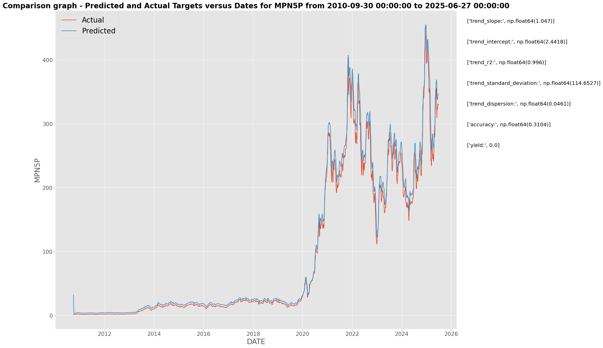
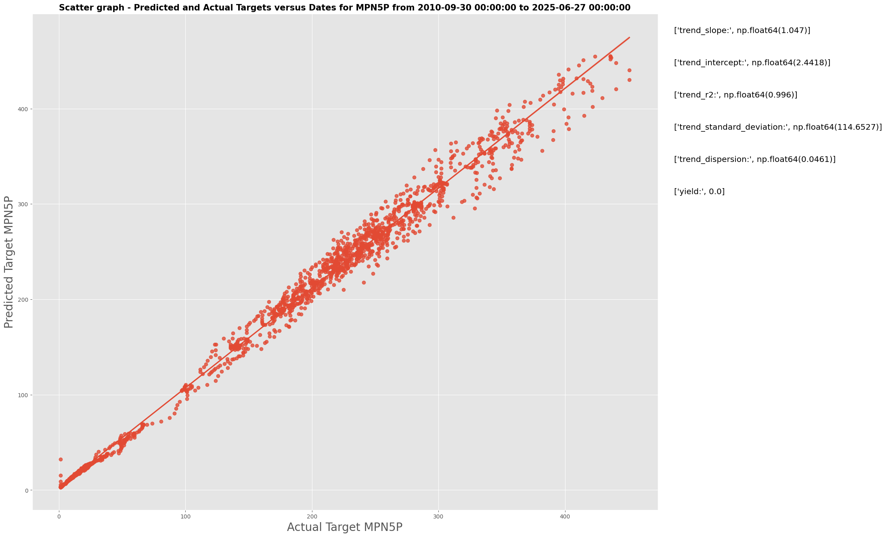
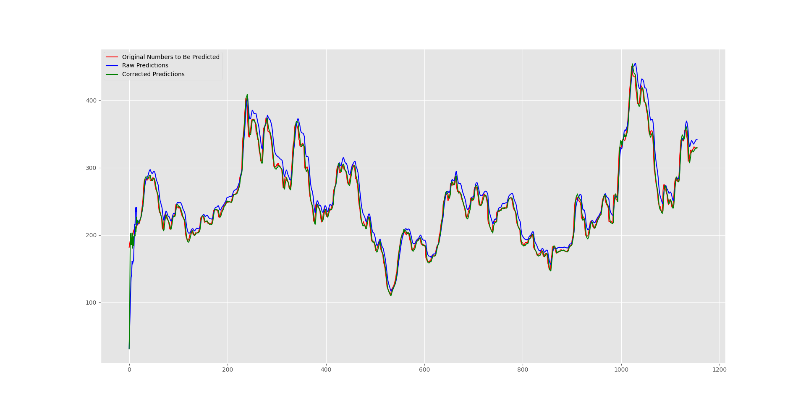
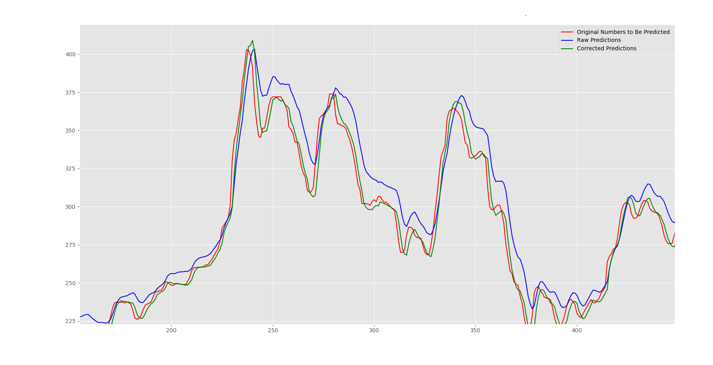

# Stock Prediction Engine Using LSTM & MLP

---

## 📝 Overview
This project implements a **stock price prediction engine** using **LSTM** and **MLP** models. The focus is on testing various configurations, documenting the **best hyperparameters**, and presenting model performance.  

Key points:  
- Data preprocessing to avoid leakage and ensure correct time-series handling.  
- Training with **early stopping**, **L2 regularization**, and **K-Fold Cross Validation**.  
- Hyperparameter tuning to find optimal configurations.  
- Evaluation and comparison between LSTM and MLP models.  

---

## ⚙️ Model Training & Evaluation
- Both **LSTM** and **MLP** models tested extensively.  
- **Training functions** include preprocessing, evaluation, and hyperparameter search.  
- Cross-validation ensures robustness of results.  
- **Metrics computed after proper preprocessing** to avoid inconsistencies.  

---

## 📊 Results Visualization

  
  

  
  

**Figure Descriptions:**  
- `stock_prediction_vs_target.png` – Predicted vs target stock values.  
- `scatter_plot_predictions.png` – Scatter plot of predicted vs target.  
- `mlp_corrected.png` – Corrected MLP predictions with best hyperparameters.  
- `mlp_corrected_zoomed.png` – Zoomed-in view of corrected MLP predictions.  

---

## 🛠 Utilities
- Preprocessing functions to select proper transformations dynamically.  
- Training and evaluation functions that handle **early stopping**, **regularization**, and **cross-validation**.  
- Hyperparameter tuning implemented to find optimal model settings.  

---

## 📁 Repository Structure

| Path         | Description |
|--------------|-------------|
| `notebooks/` | Jupyter notebooks for testing and experiments (work-in-progress) |
| `utils/`     | Preprocessing and helper functions |
| `assests/`   | Figures and visual results |
| `README.md`  | Project documentation |
| `.gitignore` | Ignored files configuration |

---

## 📄 Notes
- Notebooks are **work-in-progress**.  
- The focus of this repository is **documenting the best hyperparameters and model testing results** rather than fully finished notebooks.  
